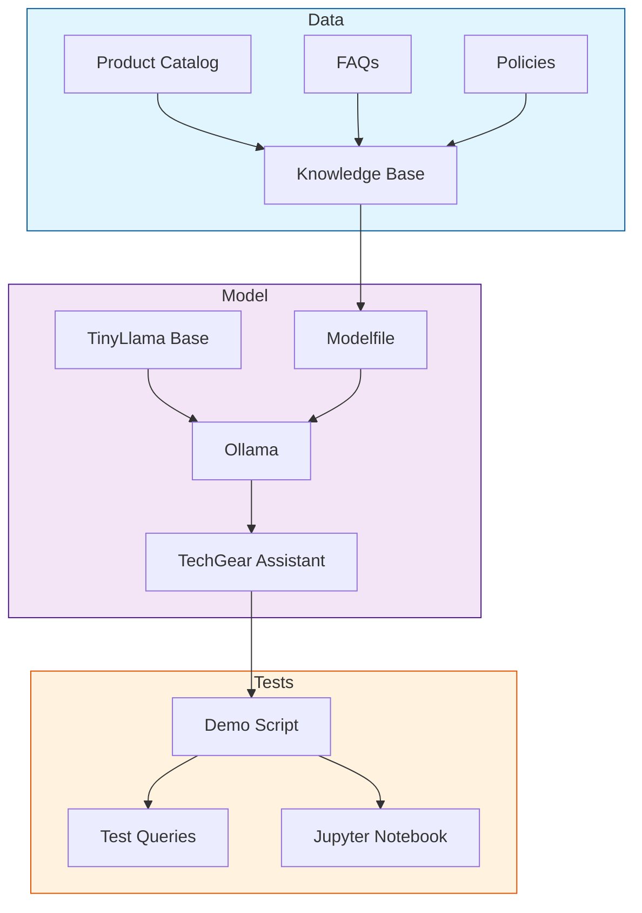

# E-commerce LLM Assistant

A proof of concept demonstrating the use of small, efficient LLMs (TinyLlama/Orca-Mini) for e-commerce customer service using Ollama.

## Overview

This project showcases how to create custom knowledge-enhanced language models for e-commerce customer service applications. It demonstrates how to use Ollama with lightweight models to understand product catalogs, FAQs, and company policies, enabling accurate and context-aware customer support responses.

## Prerequisites

- Python 3.10+
- Ollama installed (https://ollama.ai)
- Required Python packages (see requirements.txt)

## Quick Start

1. Install Ollama:
```bash
curl -fsSL https://ollama.com/install.sh | sh
```

2. Clone this repository:
```bash
git clone https://github.com/schmitech/ecommerce-llm-assistant.git
cd ecommerce-llm-assistant
```

3. Set up Python environment:
```bash
python -m venv venv
source venv/bin/activate  # On Windows: venv\Scripts\activate
pip install -r requirements.txt
```

4. Create and prepare the model:
```bash
# Option A: Run the automated demo script (recommended for demos)
chmod +x scripts/run_demo.sh
./scripts/run_demo.sh

# Option B: Run commands manually
ollama create techgear -f models/modelfiles/techgear.ollama
python scripts/prepare_data.py
```

5. Run the demo (if not using the demo script):
```bash
# Option A: Run the test script
python scripts/test_model.py

# Option B: Run the interactive notebook
jupyter notebook notebooks/demo.ipynb
```

## Demo Features

- Sample electronics store product catalog
- Common customer service scenarios
- Before/after comparison of responses
- Performance metrics for model evaluation

## Sample Use Cases

The demo includes examples of:

1. Product Information Queries
```python
Query: "What are the specifications of the TG-Phone Pro X?"
```

2. Return Policy Questions
```python
Query: "How do I return a defective item?"
```

3. Shipping Information
```python
Query: "What are the shipping options for international orders?"
```

## Model Configuration

The project uses Ollama with TinyLlama as the base model. We specifically use TinyLlama-1.1B-Chat-v1.0 for its efficient balance of performance and resource usage. Custom knowledge is integrated through the modelfile:

```modelfile
FROM tinyllama:1.1b-chat-v1.0
PARAMETER temperature 0.7
SYSTEM "You are a customer service assistant..."
# Additional configuration in models/modelfiles/techgear.ollama
```

Note: You can also use Orca-Mini as an alternative base model by changing the modelfile's FROM directive to:
```modelfile
FROM orca-mini
```

Both models provide good performance for customer service tasks while remaining lightweight enough for local deployment.

## Running Tests

To validate the model's responses and behavior:

```bash
# Run all tests with detailed output
python -m unittest tests/test_responses.py -v
```

The test suite validates:
- Product information accuracy
- Policy response correctness
- Response quality and consistency
- Handling of out-of-scope queries

## Technical Architecture



## License

This project is licensed under the Apache 2.0 License - see the LICENSE file for details.

## Acknowledgments

- Ollama team for their excellent LLM deployment tool
- TinyLlama and Orca-Mini teams for the efficient base models
- Contributors and testers

## Model Management

To manage the TechGear model:

```bash
# Remove the TechGear model to start fresh
ollama rm techgear

# List all available models
ollama list

# Recreate the model after making changes
ollama create techgear -f models/modelfiles/techgear.ollama
```

These commands are useful when you want to:
- Start fresh with a new model configuration
- Adjust training parameters in the modelfile
- Troubleshoot model behavior
- Clean up unused models

After recreating the model, run the test script to verify the changes:
```bash
python scripts/test_model.py
```

## Demo Script

The project includes an automated demo script (`scripts/run_demo.sh`) that:
- Cleans up any existing models
- Creates and prepares the TechGear assistant
- Runs test queries with visual feedback
- Provides clear step-by-step output

Perfect for:
- Recording demo videos
- Quick testing
- Presentations
- Clean environment setup

To use the demo script:
```bash
chmod +x scripts/run_demo.sh
./scripts/run_demo.sh
```